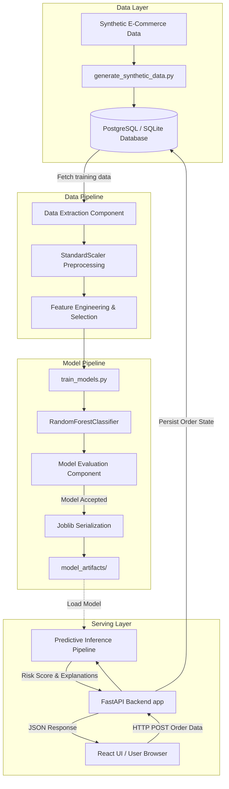
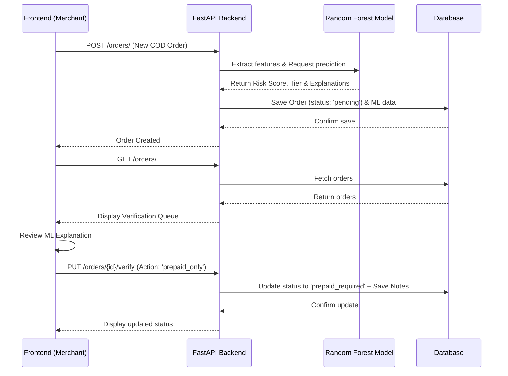

# OrderGuard AI: End-to-End Workflow

**[README](./README.md) • [Workflow & Architecture](./WORKFLOW.md) • [API Docs](./docs/api.md) • [Contributing](./docs/CONTRIBUTING.md)**

This document details the operational workflow, order state machine, and user journey within the OrderGuard AI platform.

## 1. Merchant Authentication (User Journey)
1. **Login/Registration**: The merchant accesses the React frontend and clicks "Register as Demo User" or logs in via Google OAuth.
2. **Token Issuance**: The FastAPI backend validates the identity and issues a secure JWT (JSON Web Token).
3. **Session Establishment**: The frontend stores the JWT and includes it as a `Bearer` token in the `Authorization` header for all subsequent API requests.

## 2. Order Ingestion & Risk Scoring Workflow
When a new Cash-on-Delivery (COD) order is placed on the merchant's store (or simulated via the dashboard):

1. **Payload Submission**: The frontend sends a `POST /api/v1/orders/` request with the customer details, order amount, and item count.
2. **Feature Extraction**: The backend extracts numerical features (e.g., `num__address_length`, `num__order_value`) from the raw payload.
3. **ML Inference**: 
   - The backend loads the pre-trained `RandomForestClassifier` pipeline from `model_artifacts/`.
   - It computes the **Risk Score** (probability of RTO).
   - It determines the **Risk Tier** (LOW, MEDIUM, HIGH) based on score thresholds.
   - It extracts the **Top Contributing Features** (statistical reasons) for explainability.
4. **Database Persistence**: The order is saved to the PostgreSQL/SQLite database with an initial status of `pending`, containing the ML metadata.
5. **UI Update**: The frontend fetches the updated list of orders, and the new order appears in the Verification Queue.

## 3. Order Verification & State Machine (Human-in-the-loop)
Once an order is in the Verification Queue, the merchant reviews the ML risk assessment and makes a business decision.

### The State Machine Transitions:
- **`pending`**: The default state upon ingestion. The order is waiting for manual review.
- **`verified`**: The merchant explicitly approves the COD order because the risk is deemed acceptable.
- **`prepaid_required`**: The merchant determines the COD risk is too high and clicks **"Allow Prepaid Only"**. The customer must pay upfront for the order to be fulfilled.
- **`rejected`**: The order is entirely blocked (if supported by specific merchant workflows).

### Review Process:
1. **Review**: The merchant clicks the **Review** button to open the Order Details Modal.
2. **Context**: They read the AI Risk Assessment, noting the score, tier, and specific contributing factors (e.g., unusually high order value).
3. **Action**: The merchant selects an action (e.g., `Allow Prepaid Only`) and optionally leaves "Reviewer Notes".
4. **Resolution**: The frontend sends a `PUT /api/v1/orders/{id}/verify` request. The backend updates the order status and persists the audit notes. The queue updates visually to reflect the new state.

## 4. System Architecture & Components
OrderGuard AI is a full-stack risk management platform consisting of:
- **Frontend (React / Vite)**: A merchant dashboard for reviewing incoming COD (Cash on Delivery) orders.
- **Backend API (FastAPI)**: Serves order ingestion, retrieval, verification logic, and orchestrates risk assessment.
- **Database (PostgreSQL / SQLite)**: Stores user credentials (merchants), ingested orders, risk predictions, and verification statuses via SQLAlchemy.
- **ML Pipeline (scikit-learn)**: A pre-trained Random Forest model that evaluates orders based on features like address length, name length, and order value to produce risk probabilities and explainable factors.

### 4.1 Architecture & Layer Diagram

### 4.2 Request Workflow Sequence

## 5. Architectural Limitations
- Model artifacts are loaded into memory on server start. High concurrency might require model serving alternatives (e.g., ONNX, Ray Serve).
- Explanation logic is derived statistically and provides predictive transparency, not direct causal reasons.
