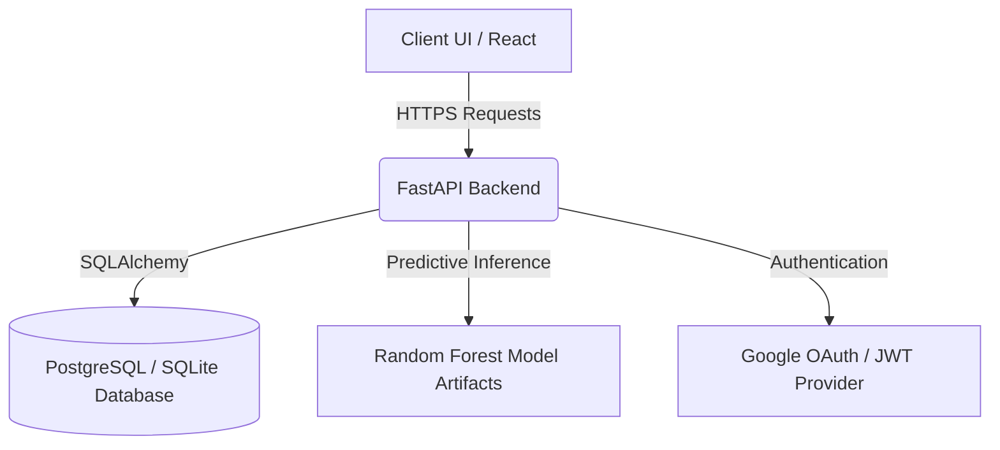

# System Architecture

## Overview
OrderGuard AI is a full-stack risk management platform consisting of:
- **Frontend (React / Vite)**: A merchant dashboard for reviewing incoming COD (Cash on Delivery) orders.
- **Backend API (FastAPI)**: Serves order ingestion, retrieval, verification logic, and orchestrates risk assessment.
- **Database (PostgreSQL / SQLite)**: Stores user credentials (merchants), ingested orders, risk predictions, and verification statuses via SQLAlchemy.
- **ML Pipeline (scikit-learn)**: A pre-trained Random Forest model that evaluates orders based on features like address length, name length, and order value to produce risk probabilities and explainable factors.

## Architecture Diagram

## Data Flow
1. **Order Creation:** A merchant creates an order via the dashboard. The backend validates this payload.
2. **Prediction Pipeline:** The backend extracts numerical features and executes `model.predict_proba()` to evaluate the risk score.
3. **Database Persistence:** The order details, including the risk score, risk tier, and explanations (top contributing features), are stored in the database.
4. **Verification Action:** Merchants review the queue. They can choose to Approve (verified) or Allow Prepaid Only (prepaid_required). This modifies the order state.

## Limitations
- Model artifacts are loaded into memory on server start. High concurrency might require model serving alternatives (e.g., ONNX, Ray Serve).
- Explanation logic is derived statistically and provides predictive transparency, not direct causal reasons.
